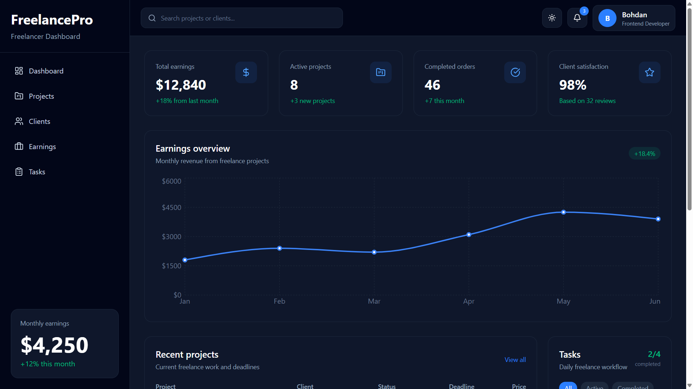
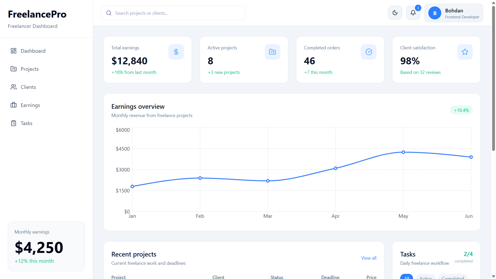
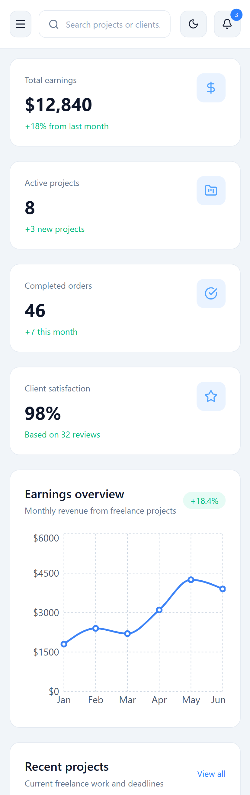

# FreelancePro Dashboard

Modern freelancer dashboard built with React and Tailwind CSS.

## Preview

FreelancePro is a responsive SaaS-style dashboard designed for freelancers to manage projects, clients, tasks, and earnings.

The project focuses on clean UI, responsive layouts, reusable React components, dark/light theme support, and interactive dashboard elements.

---

## Features

- Responsive dashboard layout
- Dark / light theme
- Interactive sidebar navigation
- Search functionality
- Notifications dropdown
- Earnings chart with Recharts
- Projects section with detailed modals
- Clients section with detailed modals
- Task management system
- LocalStorage persistence
- Mobile-friendly modals
- Smooth UI interactions

---

## Tech Stack

- React
- Vite
- Tailwind CSS
- Recharts
- Lucide React

---

## Screenshots

### Dark Theme



### Light Theme



### Mobile Version



---

## Installation

```bash
npm install
npm run dev
Project Goals

This project was created to practice:

Modern React development
Component architecture
Responsive dashboard UI
State management
Interactive frontend behavior
Real-world SaaS interface design
Author

Bohdan Bedrynets
Frontend Developer